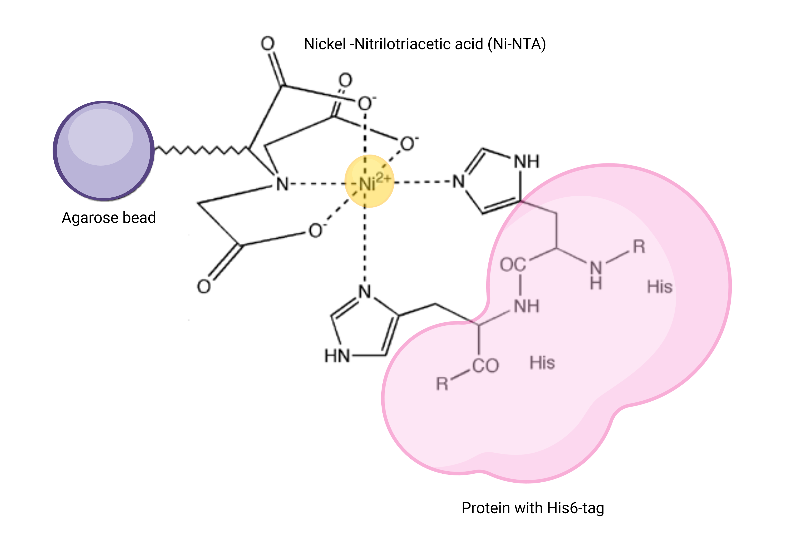
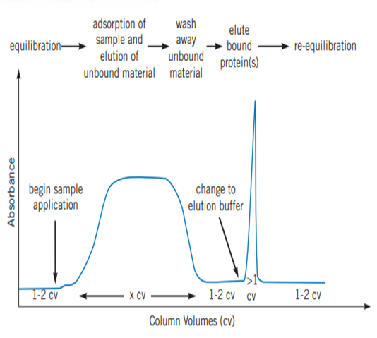
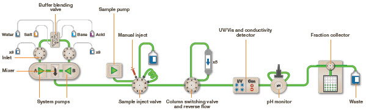

## Objective

Affinity chromatography is a biophysical technique that exploits the unique biological function or the chemical structure of a biomolecule such that it specifically binds to an immobilized ligand reversibly and can be separated from a mixture of several biomolecules. 

## Theory

Affinity chromatography is based on the principle that a stationary phase made of a matrix medium (e.g. cellulose or agarose beads) on which the ligand (may be an oligonucleotide, protein, coenzyme, etc) bound covalently, with its reactive groups exposed. As the mixture of analytes (nucleic acids, proteins, vitamins etc) passes through the chromatography column, only the analyte of interest that has highly specific binding interaction with the immobilized ligand will bind to the stationary phase, while all other biomolecules will be eluted as flow through.

**The different types of biological interactions exploited in affinity chromatography**

Listed below are the examples of various types of biological interactions utilized in the affinity chromatographic purification technique:
-	Antigen - antibody
-	Enzyme - substrate analogue
-	Binding protein - Ligand
-	Receptor - ligand
-	Lectin - polysaccharide, glycoprotein
-	Nucleic acid - complementary base sequence
-	Hormone, vitamin - receptor, carrier protein.
-	Glutathione - glutathione-S-transferase or GST fusion proteins.
-	Metal ions - Poly (His) fusion proteins, native proteins with histidine or cysteine on their surfaces.

**The molecular basis of these biological interactions**

These highly specific strong binding interactions between immobilized ligand and target biomolecule are attributed to electrostatic, hydrogen bonding, hydrophobic interactions, and van der Waals' forces. 
The elution of the target molecule from the chromatographic column can be achieved in two ways:
1.	Bio-specific elution by adding a high concentration of ligand (or a ligand analogue) to the elution buffer, so that there is competition between the free and immobilised ligand for the analyte of interest.
2.	Non-specific elution by denaturing the biomolecule by changing the pH or ionic strength of the eluent to weaken the binding interaction between the analyte and the immobilized ligand.

**Ni-NTA affinity chromatography helps to purify proteins with His6 tag**

Ni-NTA-based affinity chromatography is one of the most widely used affinity chromatography techniques to purify proteins recombinantly produced with a hexahistidine tag or naturally rich in histidine amino acids. This is a special type of affinity chromatography called **Immobilized Metal Affinity Chromatography (or IMAC)**, in which nickel is covalently coupled to agarose using the chemical compound nitrilotriacetic acid (NTA). NTA is a hexadentate ligand that coordinates Ni2+ ion and His residues in the analyte protein (natural or recombinantly synthesized with a His6 ¬tag) bind to this coordination complex **(Figure 1)**. This binding is attributed to the intrinsic property of His to bind to metals like Ni and Co. 

 Figure 1: The principle of Ni-NTA affinity purification

**FPLC exploits the Ni-NTA affinity chromatography technique to purify His6-tagged proteins**
 
Fast Pressure Liquid Chromatography (FPLC) is used to efficiently purify natural proteins or recombination fusion proteins with a hexahistidine tag using the principle of Ni-NTA IMAC. It provides high resolution of purification, even a small quantity of highly pure (nearly 95% purity) desired protein in its native, biologically active form can be purified from a large quantity of cell lysate. FPLC can also be used to purify nucleic acids. 
In FPLC, the solvent velocity can be manipulated by the user through a software interface to maintain the constant flow rate of the solvents. It is a type of liquid chromatography, where the mobile phase is an aqueous media. The stationary phase is composed of beads (cross-linked agarose), packed into a cylindrical column. When the solution passes through the detectors, salt concentration (by conductivity) and protein concentration (by absorbing ultraviolet light at a wavelength of 280nm) are measured. This data is represented as a chromatogram **(Figure 2)**. The instrumentation and flow path of FPLC is elucidated in **Figure 3**. 

 Figure 2: Typical chromatogram obtained by affinity purification

 Figure 3: Flow path of FPLC

