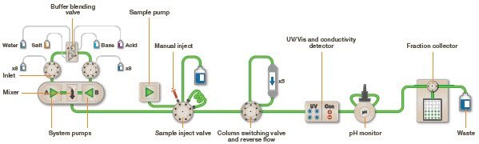

 ## Theory

Chromatography is a biochemical technique used to separate the components of a mixture based on the differences in their properties. It relies on the principle that different substances will interact differently with two phases:
- Stationary phase: A solid or liquid supported on a solid (paper or resin).
- Mobile phase: A liquid or gas that moves through or over the stationary phase.
As the mobile phase flows, the components of the mixture migrate at different rates due to differences in **affinity, polarity, size, or charge,** allowing them to be separated.  

Affinity chromatography is based on the principle that a stationary phase made of a matrix medium (e.g. cellulose or agarose beads) on which the ligand (may be an oligonucleotide, protein, coenzyme, etc) bound covalently (using CNBr/epoxy group), with its reactive groups exposed.  

As the mixture of analytes (nucleic acids, proteins, vitamins etc) pass through the chromatography column, only the analyte of interest that has highly specific binding interaction with the immobilized ligand will bind to the stationary phase, while all other biomolecules will be eluted as flow through.

#### **The different types of biological interactions exploited in affinity chromatography**

Listed below are the examples of various types of biological interactions utilized in the affinity chromatographic purification technique:
- Antigen 
  - Antibody
- Enzyme 
  - Substrate analogue
- Binding protein 
  - Ligand
- Receptor 
  - Ligand
- Lectin 
  - Polysaccharide
  - Glycoprotein
- Nucleic acid 
   - Complementary base sequence
- Hormone, vitamin 
   - Receptor
   - Carrier protein
- Glutathione 
   - Glutathione-S-transferase or GST fusion proteins
- Metal ions 
   - Poly (His) fusion proteins 
   - Native proteins with histidine 
   - Cysteine on their surfaces

#### **The molecular basis of these biological interactions**

These highly specific strong binding interactions between immobilized ligand and target biomolecule are attributed to electrostatic, hydrogen bonding, hydrophobic interactions, and van der Waals' forces. 

 Figure 1: Molecular basis of protein-ligand interactions.

In affinity chromatography, the solid phase (resin/matrix) serves as an inert, porous support that facilitates binding by allowing macromolecules to access immobilized ligands. Ligands—such as substrates, cofactors, or antibodies—are covalently attached using crosslinkers, often with spacer arms to reduce steric hindrance and maintain accessibility. Effective attachment preserves the ligand’s binding function. The mobile phase comprises buffers and controls binding and elution. The binding buffer has pH and ionic strength optimal for the protein-ligand interaction, the wash buffer removes non-specific interactions, and the elution buffer disrupts binding via pH changes or competitive agents. Together, these elements ensure high specificity and efficiency in target purification.  

The elution of the target molecule from the chromatographic column can be achieved in two ways:
1.	**Bio-specific elution** by adding a high concentration of ligand (or a ligand analogue) to the elution buffer, so that there is competition between the free and immobilised ligand for the analyte of interest.
2.	**Non-specific elution** by denaturing the biomolecule by changing the pH or ionic strength of the eluent to weaken the binding interaction between the analyte and the immobilized ligand.

#### Examples of Affinity Chromatography Applications:
- **His-tagged Proteins:** Purification using immobilized metal affinity chromatography (IMAC) with Ni²⁺ or Co²⁺.
- **Antibody Purification:** Protein A/G affinity chromatography for IgG purification.
- **Enzyme Substrate Affinity:** Using immobilized substrates or inhibitors to purify enzymes.
- **Lectin Affinity Chromatography:** For glycoproteins that bind to specific carbohydrates.

#### **Ni-NTA affinity chromatography helps to purify proteins with His6 tag**

Ni-NTA-based affinity chromatography is one of the most widely used affinity chromatography techniques to purify proteins recombinantly produced with a hexahistidine tag or naturally rich in histidine amino acids. This is a special type of affinity chromatography called **Immobilized Metal Affinity Chromatography (or IMAC)**, in which nickel is covalently coupled to agarose using the chemical compound nitrilotriacetic acid (NTA). NTA is a hexadentate ligand that coordinates Ni2+ ion and His residues in the analyte protein (natural or recombinantly synthesized with a His6 ¬tag) bind to this coordination complex **(Figure 2)**. This binding is attributed to the intrinsic property of His to bind to metals like Ni and Co. 

 Figure 2: Mechanism of Ni-NTA affinity purification: Ni²⁺ ions chelated by nitrilotriacetic acid (NTA) groups on agarose beads coordinate with histidine residues of a His₆-tagged protein, enabling selective binding and purification.

#### **FPLC exploits the Ni-NTA affinity chromatography technique to purify His6-tagged proteins**
 
Fast Protien Liquid Chromatography (FPLC) is used to efficiently purify natural proteins or recombination fusion proteins with a hexahistidine tag using the principle of Ni-NTA IMAC. It provides high resolution of purification, even a small quantity of highly pure (nearly 95% purity) desired protein in its native, biologically active form can be purified from a large quantity of cell lysate. FPLC can also be used to purify nucleic acids. 
In FPLC, the solvent velocity can be manipulated by the user through a software interface to maintain the constant flow rate of the solvents. It is a type of liquid chromatography, where the mobile phase is an aqueous media. The stationary phase is composed of beads (cross-linked agarose), packed into a cylindrical column. When the solution passes through the detectors, salt concentration (by conductivity) and protein concentration (by absorbing ultraviolet light at a wavelength of 280nm) are measured. This data is represented as a chromatogram **(Figure 3)**. The instrumentation and flow path of FPLC is elucidated in **(Figure 4)**. 

 Figure 3: Typical chromatogram obtained by affinity purification

 Figure 4: Schematic diagram of the flow path in a Fast Protein Liquid Chromatography (FPLC) system used for automated protein purification

#### Elution of Desired Proteins in Affinity Chromatography
Once the target protein is bound to the affinity resin, it must be efficiently eluted from the column while maintaining its structure and function. The following method is used for the displacement of bound desired protein with increasing concentration of a competitor molecule.

##### 1. Gradient Elution
- In gradient elution, the elution buffer composition is gradually changed to weaken the interaction between the protein and the ligand. The concentration of a competing molecule (e.g., free ligand, imidazole, or a substrate analogue) is increased stepwise or continuously.
- In Ni-NTA affinity chromatography, imidazole (structurally similar to the side-chain of histidine) gradient elution is commonly used to elute His-tagged proteins. Initially, a low concentration of imidazole (e.g., 10–20 mM) is used to remove weakly bound contaminants. The concentration is then gradually increased (e.g., 250–500 mM) to elute the desired protein. Free imidazole group has higher mobility and competes with the target protein to bind to Ni2+. It binds to Ni2+ with high affinity displacing the bound target protein and allowing it to elute.

#### 2. Salt Gradient Elution
- This method relies on altering the ionic strength of the elution buffer to weaken electrostatic interactions. Increasing the concentration of a salt (e.g., NaCl or KCl) competes with ionic interactions between the bound protein and the ligand.
- For example, in Protein A affinity chromatography for antibody purification, a salt gradient (e.g., 0–1 M NaCl) is applied to modulate the binding strength and selectively elute different subclasses of immunoglobulins.

#### Poor binding of target protein and non-specific binding in affinity chromatography 
Low protein binding in affinity chromatography can result from incorrect buffer pH or ionic strength, inactive or improperly immobilized ligands, or poor column equilibration. Non-specific binding often arises due to hydrophobic or electrostatic interactions between proteins and the matrix or contaminants. Inadequate sample clarification or lack of wash buffer optimization can further exacerbate these issues. Proper buffer conditions, resin blocking, and sample preparation are key to minimizing such problems.

#### Troubleshooting strategies for FPLC

The common problems of FPLC-based protein purification and the ways to troubleshoot them are mentioned

Problem | Possible Cause | Solution | 
:--|:--|:--|
Sample is too viscous| High DNA or cell debris content | Sonicate the lysate, increase centrifugation time, or treat with DNase to reduce viscosity|
Protien elutes during wash step | Imidazole concentration in the wash buffer is too high | Optimize imidazole concentration in th wash buffer to ensure selective elution of contaminants while retaining the target protein|
Loss of target protein or incomplete removal of contaminants during wash| Wash buffer conditions (pH, salt, imidazole, or detergent) are not optimized | Optimize the wash buffer conditions by varying the salt concentration, pH, detergent (e.g., 0.01–0.1% Triton X-100), or imidazole (for His-tags) or salt-gradient wash to remove impurities. Perform stepwise washes and analyze fractions (e.g., SDS-PAGE) to ensure contaminants are removed while the target remains bound. Use low-temperature conditions (4°C).|
Low yeild of target protein| Harsh wash/elution conditions or irreversible binding or aggregation| Optimize wash and elution buffer conditions, add stabilizers (glycerol, DTT, protease inhibitors)|
The resin performance declines over time | Accumulation of contaminants or metal ion leaching | Regenerate the resin by stripping and recharging with metal ions as per the manufacturer's instructions. |
Broad peaks/poor resolution | Overloading the column Otherwise fast flow rate| Reduce sample load, reduce flow rate |
High back pressure | Column clogging (due to particulates or sample precipitates), air bubbles or microbial growth or crystallized buffer salts | Filter all buffers and samples using 0.22–0.45 µm filters. Wash column with high-salt or mild detergents. Store columns in bacteriostatic agents (e.g., 20% ethanol or sodium azide) |

